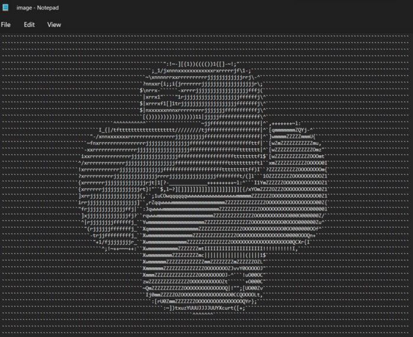

<h1 align="center">Image to ASCII</h1>

<div align= "center"> 

<br/>

  <h4>This is a project in which we are going to create a python program which converts an Image to ASCII art.</h4>
</div>

<br/>

# Table of Contents 

- [Table of Contents](#table-of-contents)
- [:warning: Frameworks and Libraries](#warning-frameworks-and-libraries)
- [:key: Prerequisites](#key-prerequisites)
- [🚀&nbsp; Installation](#-installation)
- [:bulb: How to Run](#bulb-how-to-run)
- [📂 Directory Tree](#-directory-tree)
- [:key: Results](#key-results)
- [:clap: And it's done!](#clap-and-its-done)
- [:raising_hand: Citation](#raising_hand-citation)
- [:heart: Owner](#heart-owner)
- [:eyes: License](#eyes-license)

<br/>

# :warning: Frameworks and Libraries

- **[Tkinter](https://docs.python.org/3/library/tkinter.html):** The tkinter package (`Tk interface`) is the standard Python interface to the Tcl/Tk GUI toolkit. Both Tk and tkinter are available on most Unix platforms, including macOS, as well as on Windows systems.

<br/>

# :key: Prerequisites

All the dependencies and required libraries are included in In-Built Python download.

<br/>

# 🚀&nbsp; Installation

The Code is written in Python 3.7. If you don&rsquo;t have Python installed you can find it [here](https://www.python.org/downloads/). If you are using a lower version of Python you can upgrade using the pip package, ensuring you have the latest version of pip. To install the required packages and libraries, run this command in the project directory after [cloning](https://www.howtogeek.com/451360/how-to-clone-a-github-repository/) the repository:

1. Clone the repo

```bash
git clone https://github.com/Chaganti-Reddy/Img-Ascii.git
```

2. Change your directory to the cloned repo

```bash
cd Img-Ascii
```

3. Now, run the following command in your Terminal/Command Prompt to install the libraries required

```bash
python3 -m virtualenv my_env

source my_env/bin/activate

```

<br/>

# :bulb: How to Run

1. Open terminal. Go into the cloned project directory and type the following command:

```bash
python3 Img-Ascii.py
```

<br/>

# 📂 Directory Tree

```
├── assets
│   ├── im2.jpg
│   └── main.png
├── image.txt
├── Img-Ascii.ipynb
├── Img-Ascii.py
├── LICENSE
└── README.md
```

<br/>

# :key: Results

<p align="center">
  
</p>

<br/>

# :clap: And it's done!

Feel free to mail me for any doubts/query
:email: chagantivenkataramireddy1@gmail.com

---

# :raising_hand: Citation

You are allowed to cite any part of the code or our dataset. You can use it in your Research Work or Project. Remember to provide credit to the Maintainer Chaganti Reddy by mentioning a link to this repository and his GitHub Profile.

Follow this format:

- Author's name - Chaganti Reddy
- Date of publication or update in parentheses.
- Title or description of document.
- URL.

# :heart: Owner

Made with :heart:&nbsp; by [Chaganti Reddy](https://github.com/Chaganti-Reddy/)

# :eyes: License

MIT © [Chaganti Reddy](https://github.com/Chaganti-Reddy/Img-Ascii/blob/main/LICENSE)
